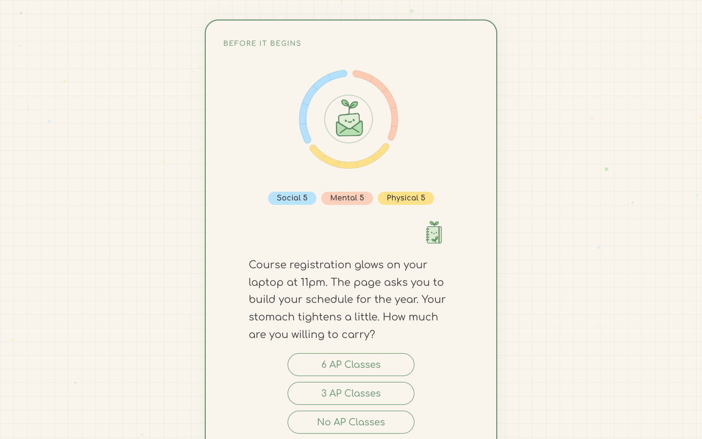

<p align="center">
  
</p>

# Before It Breaks

A short narrative game about one high-school semester, part of the Dear Future Me platform. About ten minutes, eight decisions, and three stats you're trying not to run out of.

**Live:** <https://before-it-breaks.vercel.app>

## Why

Students are told to "balance" school, friends and sleep, but rarely get to see what the tradeoffs feel like. Before It Breaks puts familiar choices in front of you (how many AP classes, whether to go out the first Friday, which club to join) and shows the cost of each one. It's meant to work as a mirror, not a game about winning.

## What it does

- Walks through a semester as a sequence of scenes, each with a short prompt and two or three choices.
- Every choice moves three stats (Social, Mental, Physical), shown as a hand-drawn three-arc ring around the Dear Future Me logo.
- After each choice, a one-line reflection fades in before the next scene.
- If any stat hits zero the game ends early; otherwise it closes with a final reflection on how the semester went.

## Design

A calm, single-card storybook on Dear Future Me graph paper, with pastel confetti drifting slowly upward behind it. Each stat has its own soft color so the ring reads at a glance.

| | |
|---|---|
| Type | Comfortaa 400/700, with italic for reflections; 21 px prompts at 1.7 line height |
| Color | `#5D8E67` dark green (headings, buttons) · `#F9F5ED` paper · `#B7E3FF` social · `#FFD1BD` mental · `#FEE188` physical |
| Motion | CSS only: 250 ms fade between scenes, 300 ms slide-up choices, 500 ms ring pulse on stat change, canvas particle drift |

## How it works

The whole story is data: `src/data/gameScript.js` lists each scene's prompt, choices, stat effects, next scene and reflection, so writing new branches doesn't touch component code. `useGameState` tracks the current scene and stats and decides when the game is over, and `HealthBar` layers PNG arc segments to draw the ring. Styling uses CSS Modules and the custom properties in `src/styles/tokens.css`.

**Stack:** React 19 · React Router 7 · Vite · CSS Modules · HTML canvas

## Run locally

```bash
npm install
npm run dev
```
